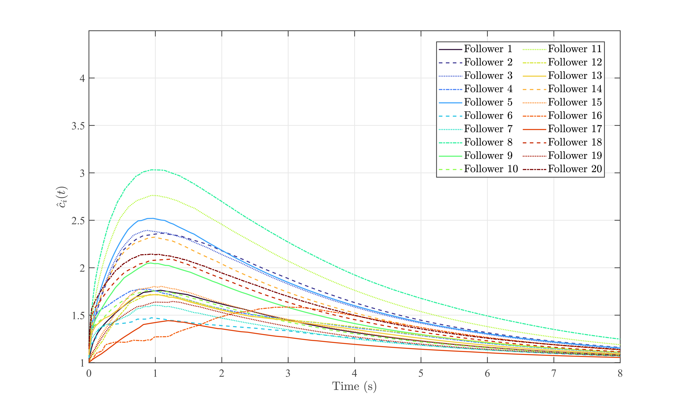
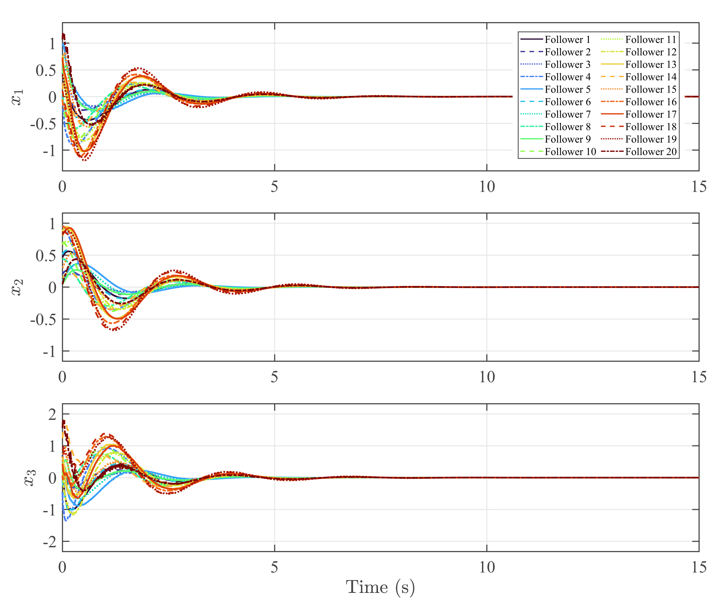

# Supplementary Results for the 20-Agent Scalability Experiment

## Communication topology in the 20-agent scalability experiment

  &emsp;&emsp;In the 20-follower scalability experiment, the follower network is modeled by a directed communication topology composed of three layers of links. First, a directed chain is used as the backbone, namely, follower 2 receives information from follower 1, follower 3 receives information from follower 2, and so on, up to follower 20, which receives information from follower 19. Second, additional forward links are introduced to enhance local connectivity, so that follower i also receives information from follower i-2 for \(i=3,...,20\). In this way, each follower is influenced not only by its immediate predecessor but also by another upstream node. Third, several longer-range directed links are added to avoid an overly sparse structure and to improve information propagation over the network. Specifically, followers 5, 10, 15, and 20 additionally receive information from follower 1, while followers 8, 12, 16, and 20 receive extra information from followers 4, 8, 12, and 16, respectively. In addition, all followers are pinned to the leader, so that each follower is coupled not only through the directed inter-agent network but also through a direct leader-following channel. This topology preserves a clear directed structure while providing sufficient information flow and connectivity for testing the scalability of the proposed method in a larger-scale multi-agent system.

## Adaptive gains in the 20-agent scalability experiment

&emsp;&emsp;The adaptive-gain trajectories in the 20-follower scalability experiment show that all adaptive gains remain bounded throughout the simulation and eventually converge to relatively close steady-state levels. During the initial transient stage, the gains increase to compensate for the weakened effective coupling caused by unreliable communications and the larger network scale. As the synchronization errors gradually decrease, the leakage-modified adaptive law suppresses further gain accumulation and drives the gains toward bounded steady values. Although slight differences can be observed in the transient profiles of individual followers due to the directed topology and nonuniform information flow, the overall gain trajectories remain well concentrated in the steady stage. This result further supports the bounded-gain property and scalability of the revised solo-adaptive design in the larger 20-agent network.
## Tracking errors in the 20-agent scalability experiment

&emsp;&emsp;The tracking-error trajectories in the 20-follower experiment show that all followers progressively reduce their deviations from the leader despite the increased network size and the directed communication topology. Owing to the heterogeneous information flow and stochastic link activations, the transient responses of different followers are not identical. Nevertheless, all state errors decay with time and are ultimately confined to a small neighborhood of the origin, which indicates practical leader-follower synchronization in the larger-scale network. Together with the bounded adaptive-gain trajectories, this supplementary result shows that the proposed method maintains satisfactory synchronization performance when extended to a 20-agent multi-agent system.